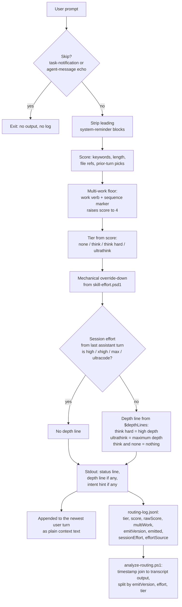

# Design: effort router, emit version 2

How a prompt becomes the guidance text Claude reads, and why the router emits
plain instructions instead of thinking keywords. The *why* of the project is in
[README.md](README.md). The scoring reference is [docs/efforts.md](docs/efforts.md).

## Flow

## Why text and not keywords

Verified on 26-09-2026 (Claude Code 2.1.281, code.claude.com/docs/en/model-config,
local binary strings, session transcripts):

- Current models think adaptively. There is no thinking budget for a keyword to
  set. Effort (`low` / `medium` / `high` / `xhigh` / `max`, plus `ultracode` =
  `xhigh` + workflow orchestration) is the only depth control. A hook cannot
  set it, and changing it mid-session costs a cache rebuild.
- Claude Code recognises only `ultrathink`, only in user-typed input, and adds
  an instruction without changing the API effort. `think` and `think hard` are
  ordinary words. A hook-injected `ultrathink` is never detected: in
  human-typed sessions the hook routed to ultrathink, no keyword instruction
  appears in the transcript, while `ultracode` keyword notices do persist.
- Text appended to the newest user turn leaves earlier cache breakpoints intact.

So the router has always been a text-steering layer. Emit version 2 makes that
explicit: each tier emits a sentence the model acts on as text.

## Decisions (design review 26-09-2026: architect, steering, cost lenses)

- **Nudge, not effort.** The depth lines steer within the session's effort. The
  docs must never promise think-hard-equivalent behaviour.
- **Proportional.** Each line says to proceed directly if the task is simpler
  than it looked. This stops a keyword false positive from turning into
  overthinking.
- **Verify only on change.** "Verify before done" applies only when code or
  files changed, so questions and reviews do not spawn test runs.
- **Depth into reasoning, not reply length.** Each line says this outright.
- **`think` emits no depth line.** It is the most frequent tier, so a line there
  costs the most output at the user's deliberately low effort. Reviewed on
  06-10-2026 against 10 days of v2 data: `think` medians 5.1k output against
  4.5k for `none`, so the tier already sits barely above no-guidance turns and
  shows no under-serving that a line would fix. Kept silent.
- **Session effort comes from the transcript.** `UserPromptSubmit` hooks get
  neither the payload `effort` object nor `CLAUDE_EFFORT` (both are
  tool-use-context only, code.claude.com/docs/en/hooks), which left
  `sessionEffort` empty on every v2 row until 06-10-2026. Every assistant entry
  in the transcript carries a top-level `effort`, so the hook takes the latest
  non-sidechain one and falls back to the env var. It lags one prompt when the
  user changes effort between turns, and the first prompt of a session (or one
  whose 50-line tail holds no assistant entry) reads as unset, so a mismatch on
  such rows is expected. `effortSource` logs which source won.
- **Suppressed at high session effort.** `high` / `xhigh` / `max` / `ultracode`
  already reason deeply, and extra "think harder" text is the documented
  overthinking path. Intent hints still emit. Unset effort is treated as low.
- **Tier names kept** as internal labels. They are coupled to `$tierRank`, the
  psd1 table, the intent boxes, the analyzer thresholds and months of log
  history. All emitted text sits behind one table.
- **Measurable.** Every log line records `emitVersion` (legacy rows read as 1),
  `emitted` and `sessionEffort`. The analyzer groups by all three and reports
  medians. The v2 baseline starts after the multi-work floor (`192baae`) went
  live, so the same-day scoring changes do not confound it.
- **Out of scope:** changing session effort per prompt, emitting the literal
  `ultrathink`, re-tuning thresholds.

## Verifying a change

- `powershell.exe -NoProfile -File scripts\smoke-route-hint.ps1` runs the hook
  end to end in a child Windows PowerShell 5.1 against a throwaway log.
- After deploying, confirm that the live copy under
  `%USERPROFILE%\.claude\hooks\` has the same git blob hash as the committed
  file.
